# REDLINE

Falling blocks that refuse to die.

It plays like classic block stacking, except some minos are **red**. Red blocks
refuse to dissolve when a row completes: the normal blocks vanish, the red ones
stay and sink deeper into the stack. When a row is *entirely* red the whole
board tips over onto the floor and you land inside it: every block is now a
chest-high wall, and every connected cluster of red blocks has become a Doom
monster standing in the pocket it left behind. Small clusters are zombies and
imps; big ones are demons, cacodemons and barons. Kill them all with the
shotgun. Every kill explodes and takes the neighbouring blocks with it. Then the
board stands back up, the level goes up, and you keep stacking, faster.

Native Vulkan 1.3 renderer (dynamic rendering, instanced cubes and billboards,
one atlas) with ray-traced shadows and reflections on GPUs that have ray
queries, HDR bloom, volumetric light and optional voxel monsters. Art, sounds
and music come straight out of your Doom IWAD when one is present, with
procedural fallbacks so the game runs without it. The music is Doom's own MUS
scores played through a built-in OPL3 (Adlib) synthesizer using the WAD's
GENMIDI instrument bank, the way the game sounded in 1993, or the rerelease's
recorded soundtracks when `extras.wad` is around.

## Get it

Download from the
[Releases page](https://github.com/djanice1980/Doom_Redline/releases):

| Platform | File | Notes |
|---|---|---|
| Windows 10/11 | `redline-<version>-setup.exe` | Installer: Start menu and desktop shortcuts, asks where your Doom WAD is, uninstaller |
| Windows 10/11 | `redline-<version>-win64.zip` | Portable: unzip anywhere and run `redline.exe` |
| Arch / CachyOS / Manjaro | `redline-<version>-1-x86_64.pkg.tar.zst` | `sudo pacman -U <file>` |
| Debian / Ubuntu | `redline_<version>_amd64.deb` | `sudo apt install ./<file>` (needs a distro with SDL3 packages: Debian 13, Ubuntu 25.04 or later) |
| Any Linux | `redline-<version>-x86_64.AppImage` | `chmod +x` and run; SDL3 and libvorbis travel inside |
| Any Linux | `redline-<version>-Linux.tar.gz` | Portable tree; `bin/redline` |

You need your own `doom.wad` or `doom2.wad`; the game finds Steam and GOG
copies by itself and otherwise asks on first launch. Nothing else is required.
`packaging/build-release.sh` builds all of the above from a checkout.

## Screenshots

| | |
|---|---|
| 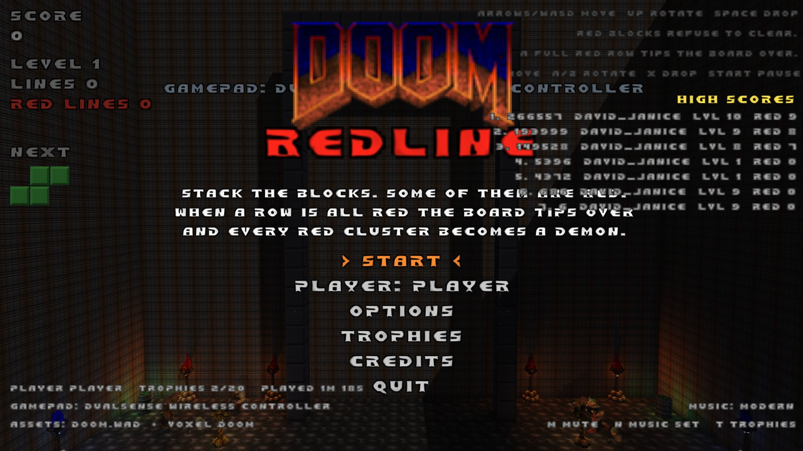 The title screen: the stack behind, high scores, the arena's brawlers | 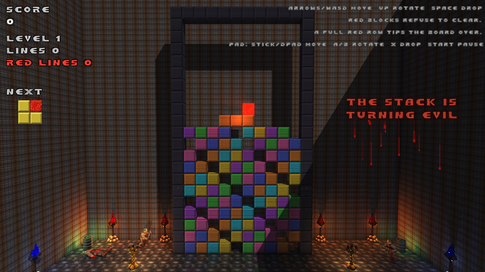 Nine rows high: the stack is turning evil and the sign beside the board bleeds |
| 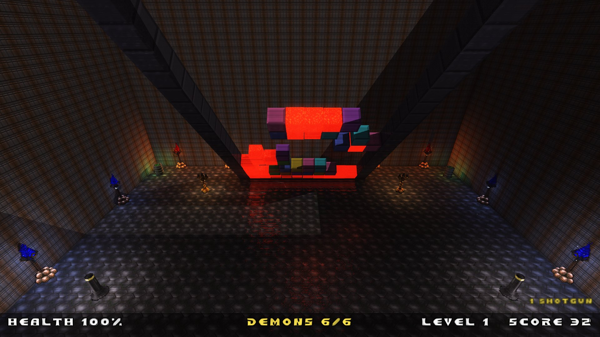 A row is all red: the board tips onto the floor and the camera flies in | 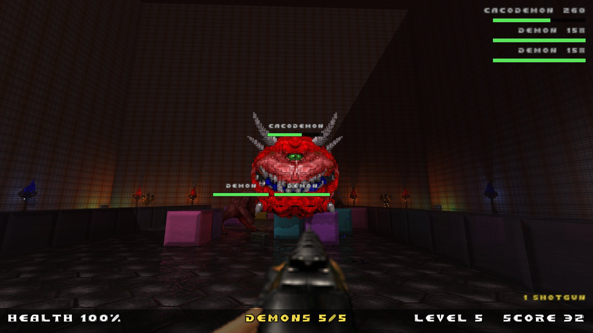 Inside the board: chest-high blocks for cover, every red cluster a monster |
| 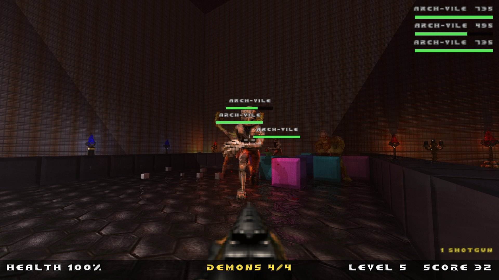 Doom 2 monsters as variants when doom2.wad is around: arch-viles raising their arms | 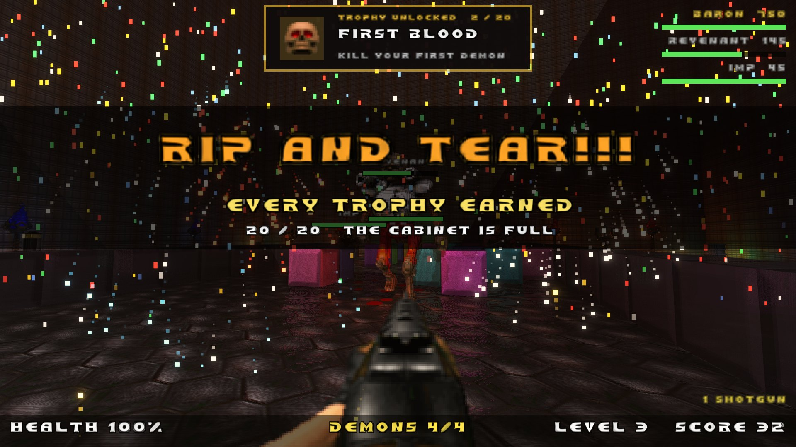 A trophy card, and the fireworks for the last one |
| 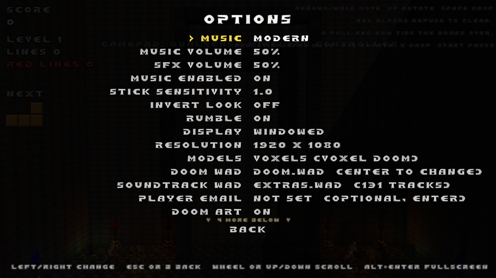 Options: music, controls, display, models, dungeon, ray tracing, anti-aliasing | 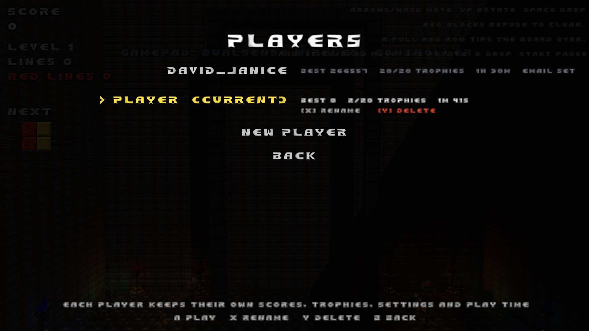 Several people on one machine: profiles with their own scores, trophies and settings |
| 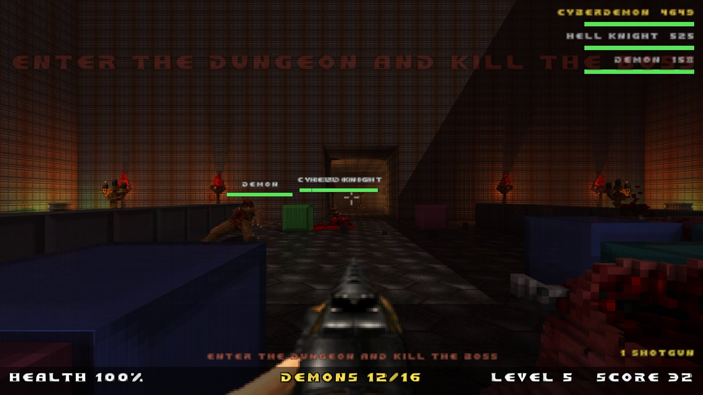 Arena cleared: the back wall has come down and the crypt's corridor opens behind the stack | 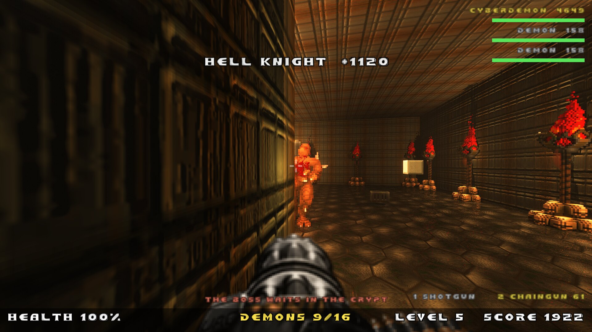 Torch-lit rooms and corridors, laid out afresh for every fight; the demons sleep until they see you |
| 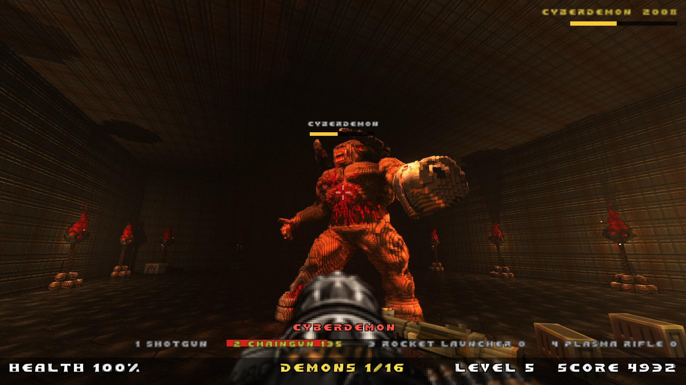 The hall at the far end: a cyberdemon boss, its health bar under the demon count | |

## How to play

1. **Stack.** Arrow keys or WASD move, Up rotates, Space hard-drops, Down
   soft-drops (a gamepad works too, see [Gamepad](#gamepad)). Complete rows
   to clear them and score; chains and combos pay more.
2. **Watch the red.** Some minos are red. They never clear: when a row
   completes, the normal blocks vanish and the red ones sink. The higher your
   stack, the more normal blocks turn red on their own, and holes that red
   blocks surround spawn evil of their own.
3. **The red line.** When a row is entirely red the board tips over and you
   land inside it with a shotgun. Every connected red cluster is a monster,
   sized by the cluster: zombies and imps from small ones, demons, cacodemons,
   barons, a cyberdemon or spider mastermind from big ones. Mouse look, WASD
   move, Shift run, click to fire, 1-4 or the wheel to change weapons.
4. **Clear the room.** Kills explode neighbouring blocks and drop health, ammo
   and weapons. Monsters chew through your cover and grow if you leave one
   alive too long.
5. **Into the dungeon.** With the arena clear the back wall comes down and a
   crypt of rooms and corridors opens behind it, laid out fresh every time and
   bigger at higher levels. Its demons sleep until they see you; its boss (a
   baron, then a cyberdemon, then the spider mastermind, tougher the higher
   your stack was) waits in a hall at the far end. Kill the boss and the board
   stands back up one level higher; die and the run ends. OPTIONS > DUNGEON
   turns the crypt off for arena-only fights.
6. **Bank prizes.** Lines you clear before a fight pay out as health, armour
   and a chance at invulnerability for that fight.

The full rules are under [Rules that differ from classic](#rules-that-differ-from-classic),
the controls under [Controls](#controls).

## The title card

REDLINE opens the way Doom did: a full-screen page, held for a couple of
seconds, that slides away in columns to leave the game behind it. The page is
built at load time out of whatever art the install has, so it is Doom's own
logo, letters and monsters over a sky, a brick wall and a stack of blocks
rather than a picture shipped with the game. Any key or button cuts the wait
short. Nothing interrupts the melt, which is also how Doom had it.

The same page, shaded blue, sits behind CONTROLS and behind the page shown on
the way out, which has your numbers on it and where to find the next version.
Esc on the title screen and QUIT both go through it; the window's close button
still exits at once.

## Windows

Grab `redline-<version>-win64.zip` (from the GitHub release, or build it as
described below), unzip it anywhere, and run `redline.exe`. The folder holds
the game, `SDL3.dll`, the three ogg/vorbis DLLs, and the four optional data
folders (`voxels`, `materials`, `brutal`, `font-hd`, see [Bundled third-party
data](#bundled-third-party-data)); nothing needs installing. Requirements:

- 64-bit Windows 10 or 11 with a Vulkan-capable GPU and a current graphics
  driver (NVIDIA, AMD and Intel drivers all ship the Vulkan loader; if the
  game reports no Vulkan device, update the driver).
- Your own `doom.wad` or `doom2.wad`. On first launch the game looks in the
  Steam and GOG install folders; if it finds nothing it asks, with a file
  browser. `extras.wad` from the Doom + Doom II rerelease, kept next to it,
  adds the two extra soundtracks.

Where things live: save data (profiles, scores, trophies, settings, the
remembered WAD path) under `%APPDATA%\redline\redline\`, and the log at
`%APPDATA%\redline\redline\redline.log`, which is the first thing to look at
if the game closes at start-up. Alt+Enter toggles fullscreen; Xbox and
PlayStation controllers work through SDL3.

The Windows installer (`redline-<version>-setup.exe`, built with Inno Setup)
does the same and asks for the WAD during setup. Building either yourself is
covered in `docs/packaging.md`: with Visual Studio and vcpkg on Windows, or
from Linux in one command with Docker (`packaging/windows/cross-build.sh`).

## Build (Arch / CachyOS)

Everything needed is a pacman package:

```bash
sudo pacman -S --needed cmake ninja gcc vulkan-headers vulkan-icd-loader shaderc sdl3 glm vulkan-radeon
```

Then, from this directory:

```bash
cmake -S . -B build -G Ninja
```

```bash
ninja -C build
```

Run the tests (rules engine + WAD reader):

```bash
ctest --test-dir build
```

Run the game:

```bash
./build/redline
```

## Doom assets

The game looks for an IWAD in this order and uses the first that exists:

1. `--wad <file>` on the command line
2. `$REDLINE_WAD`
3. The path you picked in the game, saved as `wad.txt` in the save folder
4. `redline.cfg` next to the executable (`wad=<path>`, written by the Windows installer)
5. `./wads/*.wad` and `<exe folder>/wads/*.wad` (git-ignored; drop or symlink a WAD there)
6. The Steam / GOG install of Ultimate Doom / Doom II on Linux or Windows

REDLINE never touches the network: there is no update check, no telemetry
and no online score submission in this build (the plan for an opt-in
leaderboard is in `docs/online-and-releases.md`).

To see the game without any of it, OPTIONS > DOOM ART switches to the
procedural placeholder set on the spot (and back), remembered per player;
`--no-wad` does the same for one run without touching the WAD choice.

If nothing is found, the title screen asks: **REDLINE NEEDS DOOM** offers a
native file browser, a typed path, or playing on with placeholder art. The
chosen WAD is checked, swapped in live (art, sounds, music) and remembered;
OPTIONS > DOOM WAD changes it later. You need to own the game; the WADs are
never copied anywhere. `docs/packaging.md` covers the Windows installer and
the Linux packages.

`build/src/wad/wadinfo <file.wad>` prints what a WAD contains (sprites, textures,
flats, font glyphs, sounds) and can dump individual lumps; `--help` lists flags.

## Voxel models (optional)

Monsters, pickups, projectiles and the arena decor can be drawn as 3D voxel
models instead of sprites using Cheello's *Voxel Doom* pack, which is MIT
licensed and ships with the game in `assets/voxel-doom/` (credits and licence
in that folder). Installed builds carry it next to the executable on Windows
(`voxels/`) and under `share/redline/voxel-doom` on Linux, so nothing needs
to be downloaded. A different pack or location can still be given:

1. `--voxels-dir <dir>`
2. `$REDLINE_VOXELS`
3. the bundled pack (next to the exe, `share/redline`, or `assets/` in a checkout)
4. `./voxels` and `~/.local/share/redline/redline/voxels`

Monsters have a real heading, the way Doom's do: they face the way they are
walking, chase along one of eight compass directions held for a moment, turn
at a capped rate, snap round to face you when they attack, and keep their
last heading when they die. So a voxel monster can be circled and shot in
the back; sprites stay camera-facing, as Doom's do without rotation frames.

When a pack is found, OPTIONS gains a MODELS row (SPRITES / VOXELS, default
VOXELS, saved per player); `--voxels` and `--sprites` force it for one run.
Each frame is greedy-meshed on first use (a cacodemon is about 20k quads, the
spider mastermind 60k) and drawn with real normals, so the models cast and
receive the sun shadow and pick up the torch light. Frames the pack lacks
(the plasma bolt, for example) fall back to their sprites automatically.

## Music

Doom's soundtrack plays from the WAD: the title fanfare and intermission
theme on the menu, a level track while stacking (changing with the level),
the boss-level themes during fights, and the ending music over game over.
Press M to toggle it; `--music-volume 0.3` sets the level; `--no-music`
keeps only the sound effects. OPTIONS has separate MUSIC VOLUME and SFX
VOLUME sliders; both start at 50%.

The 2024 rerelease ships two more soundtracks in `extras.wad` next to the
IWAD, and the game streams them straight out of that file: **Modern** (Andrew
Hulshult's 2023 recordings, `H_*`) and **SC-55** (the original score recorded
on a Roland SC-55, `O_*`, covering most Doom II and a few Doom tracks).
Cycle Classic / SC-55 / Modern with the N key or the MUSIC item on the title
and pause menus; the choice is remembered in `settings.txt` next to the high
scores. `--music classic|sc55|modern` sets it from the command line. If the
file is not next to the IWAD, point at it with OPTIONS > SOUNDTRACK WAD (a
file browser; the choice is saved), `--extras /path/extras.wad`,
`REDLINE_EXTRAS=/path/extras.wad`, or an `extras=` line in `redline.cfg`
next to the executable (the Windows installer asks for it). Any piece a set
lacks falls back to the classic version.

By default the tracks go through the built-in OPL3 emulator. If you prefer
General MIDI, install a soundfont and the game switches to FluidSynth
automatically (rebuild after installing so CMake picks up the library, which
is already on this machine):

```bash
sudo pacman -S --needed soundfont-fluid
```

That installs `/usr/share/soundfonts/FluidR3_GM.sf2`, which is found on its
own; any other `.sf2` works via `REDLINE_SOUNDFONT=/path/to/file.sf2`.

## High scores

Each player keeps their own top ten (score, level, red lines survived,
lines, date) in their profile folder. The title screen shows the best eight
runs across every player on the machine, each with the player's name and
your own runs highlighted; the game-over screen announces your rank in your
own table.

## Players, trophies and level-ups

The first launch asks for your name. Each player gets a profile (a folder
under `~/.local/share/redline/redline/profiles/`) holding their own high
scores, trophies and settings (music set, music and effects volume, stick
sensitivity, inverted look, rumble). Every launch after that asks **who is
playing**: the PLAYERS screen lists each profile with its best score,
trophies, play time and whether an email is set, with the last player
preselected so Enter carries on. The same screen is behind the PLAYER item
on the title screen and manages the profiles: Enter plays as one, R renames
it, E edits its email, Delete removes it (asked twice; a removed current
player drops you to another or back to the name prompt), NEW PLAYER adds
one. On a gamepad A plays, X renames, Y deletes. The game-over and pause
menus have MAIN MENU next to RESTART and QUIT.

Each profile also carries a random player id, an optional email address
(OPTIONS > PLAYER EMAIL, or the prompt after a new name) that stays unused
and unverified until you register it (below), and play statistics:
time in the block phase, the fight and the menus, and how many actions came
from the keyboard, the mouse and a gamepad, kept both as lifetime totals and
per machine (each save folder gets a random install id; the machine file
also notes the OS, GPU, core count, memory and gamepad model). The title
screen and the pause menu show your play time. Nothing leaves the machine
unless you turn ONLINE on.

## Online leaderboard

On by default. **PLAYER EMAIL** under OPTIONS starts it and the service sends
one email with a single **Approve** button: one click, nothing to type.
Players who have not set an address up are asked once on the title screen
whether they want to.

Scores are posted from the moment you start, but **nobody can see them until
you click that button**: the boards, player pages and the site's totals all
show approved players only, and declining deletes everything collected. The
game says so on the game-over screen while it waits, and notices the approval
by itself within a few seconds. Permission belongs to the address rather than
the profile, so another profile on a machine you have already approved needs
no second email; deleting a profile takes its own permission with it.
From then on every finished game is posted (the player name, the
score and game statistics, and what the machine is) with your world rank
shown on the game-over screen. **OPTIONS > ONLINE: OFF** keeps everything on
the machine and also stops the update check. **LEADERBOARD** on the title
screen shows the boards (all time, this week, fights, level, demons slain),
with your own row pinned, and keeps the last copy for offline viewing. The
address is stored encrypted and never shown; each player and each machine
is asked separately. Runs
that could not be posted wait in the profile's `runs/pending` folder and go
out at the next launch.

One address can carry several players, so a profile deleted and made again
would otherwise start a second history. Two questions keep that from
happening. Registering an address that already has players offers them, each
with its run count, best score, machines and start date: **CONTINUE AS**
moves this profile's scores onto that player and there is one player again,
**START FRESH** keeps them apart, which is what several people sharing one
address want. Deleting a registered profile asks whether to remove its
online record too, and says what that would erase; keeping it is the
default, and is what makes CONTINUE AS possible later. A removal asked for
while the machine is offline is sent at the next launch. Scripted and cheat runs (`--scenario`, `--bot`,
`--god`, `--level` and friends) are never posted. The service itself lives
in `web/` (its README explains the set-up); `docs/online-and-releases.md`
has the design and what is stored.

## New versions

With ONLINE on, the game asks the service at launch which version is the
latest, again every ten minutes while it sits on the title screen, and when
WHAT'S NEW is opened (the service itself learns of a release within a few
minutes). When a newer one exists a tilted NEW VERSION sticker sits to the
right of the title menu, zooming in and out three times as the title comes up
(and again every fifteen seconds) so it is not missed; clicking it, or the
**WHAT'S NEW** item, shows the change list (from `CHANGELOG.md`) with a
DOWNLOAD button that opens the release page in your browser. WHAT'S NEW is
always there, so the list for the version you have is a keypress away.

Trophies are one-time achievements (21 of them, from FIRST BLOOD to DOOM
SLAYER! for a new #1 high score, and RIP AND TEAR!!! for owning all the others). Unlocking one slides a console-style
card down from the top of the screen (the menu skull, TROPHY UNLOCKED,
the name, what you did, and the count), with a jingle and a rumble; it
never takes the controls away, and several unlocks queue up one after
another. RIP AND TEAR!!! is the exception: eight seconds of fireworks and
confetti over whatever is happening, a gold flash, the title slammed across
the screen and a fanfare. The full list with unlock dates is under TROPHIES on the title screen
(or press T). The pause menu shows the run so far (score, level, lines, red
lines, your best and trophy count, demons left during a fight) and has its
own TROPHIES entry; CREDITS on the title screen names the authors.

Surviving a fight brings up a level-up card: the new level, demons slain,
blocks destroyed, fight time and damage taken. The collapse plays behind it
and the next piece waits until the card is gone.

## Brutal mode

On by default (OPTIONS > BRUTAL, `--brutal 0|1`, saved with the profile
settings): every hit sprays blood that pools on the floor and splats on the
walls, overkill blows monsters apart (zombies and imps use Doom's own gib
frames, the others leave chunks), the shotgun and chaingun eject casings,
missed shots leave bullet holes, and taking damage throws blood on the
screen. The gore art comes from a bundled community pack (`assets/brutal`,
see below): spreading blood pools and drying wall splats, blood clouds at
the point of impact, sprite and voxel meat chunks, smoke at bullet holes
and blasts, brass and shells that tumble and ring when they land, and
squelching gib deaths. Without the pack the game falls back to the
player's own WAD (BLUD, POL5, PUFF, the XDEATH frames and DSSLOP), and the
placeholder art has procedural stand-ins. Blood stays for about a minute.
It is a native take on the Brutal Doom feel, not the mod itself: Brutal
Doom is a GZDoom mod (DECORATE and ZScript) and REDLINE's engine cannot run
it, so only its art and sounds are used. With the pack, monsters also die by
the weapon that killed them (shotgun fly-back, chaingun shredding, plasma
carbonising, head shots), bleed green or blue where Doom says so, Brutal
Doom's heavier weapon sounds and weapon art take over, sparks and ricochets
fly off the walls, torches carry soft flares, and the brawlers beside the
board bleed on the floor too.

## Doom 2 monsters

With doom2.wad next to the chosen WAD (the Steam re-release keeps both in
one folder) the roster grows: chaingunners stand in for imps, hell knights
and revenants for cacodemons, mancubi, arachnotrons and arch-viles for
barons, each about half the time, with their own behaviour (bursts, homing
missiles, fireball volleys, plasma streams) and voxel models from the bundled
pack. The arch-vile attacks the way it does in Doom: it screams and raises
its arms, a flame appears on your position a moment later and follows you
while it can see you, and about 2.4 seconds in its hands clasp: 20 damage,
then the flame's blast for up to 70 that throws you into the air. Break its
line of sight before the clasp and nothing happens; a hit rarely staggers
it, but when one does the attack is cancelled.
Without doom2.wad the original seven classes play as before. If doom2.wad
is the chosen WAD everything is in it already.

## Menu text

Doom's STCFN font is 8 pixels tall, and the HUD draws it four to six times
larger, so the game keeps two fonts. Small text (the hints, the status line)
uses the WAD's own pixels. Anything drawn at 3x or more uses a 4x copy of
each glyph: the AI-upscaled one from `assets/font-hd/` (Real-ESRGAN, see the
README there; regenerate with `tools/font_upscale.sh`) when the WAD's glyph
matches the one it was made from, otherwise an xBR upscale (Hyllian's
edge-directed interpolation) computed from the WAD at load time. Either way
stair-steps become smooth, anti-aliased curves. Set `REDLINE_FONT_HD=0` to
compare against the xBR route.

## Display scaling

OPTIONS > RESOLUTION means physical pixels. On a scaled desktop (KDE or
GNOME on Wayland at 150%, macOS Retina) the window is sized in points so
that its pixel size is exactly the chosen resolution, and the game renders
at that size rather than being stretched by the compositor. The log line
`[display] ...` at start-up shows points, pixels and the scale in use.

## Post-processing: HDR, bloom, anti-aliasing

The world is rendered to a 16-bit HDR target, so torches, muzzle flashes,
plasma bolts, explosions and the glowing red rows carry light past white.
A three-level bloom picks that up and a soft-knee tone curve rolls the
highlights off instead of clipping them; everything below the knee keeps
the same look as before, and the HUD is drawn afterwards at full precision.
OPTIONS > BLOOM & HAZE turns the bloom and the volumetric light off
together; OPTIONS > ANTI-ALIASING switches 4x MSAA on the world pass (2x
on GPUs without 4x). Both are machine settings in `display.txt`,
overridable per run with `--bloom 0|1` and `--msaa 0|1`.

The volumetric light is a half-resolution ray march from the camera to the
scene depth: sunlight where the shadow map says the sky reaches, and a warm
haze around every torch and lamp. The composite then ends with a warm
colour grade. Doom's textures are sampled through a mipmapped atlas with
the bilinear transition squeezed to one screen pixel, so they keep their
chunky look up close without shimmering in the distance, and every flame
sheds embers. Line clears flash and send a shockwave along the row, pieces
puff dust when they land, and the falling piece carries its own light.

## Ray tracing: shadows and reflections

On a GPU with Vulkan ray-query support (GeForce RTX, Radeon RX 6000 and
newer including the RDNA3 laptop chips, Intel Arc) OPTIONS > RAY TRACING
offers OFF (shadow map), SUN SHADOWS, SUN + ALL LIGHTS, and SUN + ALL LIGHTS
+ REFLECTIONS. With all lights on, every torch, lamp, muzzle flash, fireball
and glowing red block casts a shadow: the stack throws torchlight shadows on
the floor and monsters shadow each other. With reflections on, the arena
floor becomes a glossy surface that mirrors the stack, the walls and the
voxel monsters (one bounce per pixel, shaded with a sun shadow ray; sprite
monsters are not in the ray-traced scene, so they cast neither shadows nor
reflections). The scene's cubes and voxel models are kept in a top-level
acceleration structure rebuilt every frame. The full mode also traces three short ambient-occlusion rays per
pixel for contact shadows where blocks meet the floor. The mode is a
machine setting in `display.txt` (default: everything on); `--rt 0|1|2|3`
forces it for one run
and `REDLINE_NO_RT=1` hides the capability entirely. Other GPUs keep the
shadow map and never see the row. On a Radeon 8060S at 1600x900 the
reflections cost about 4 ms a frame on top of the all-lights mode.

With Doom art loaded, the wall and floor textures also get the normal and
roughness maps from `assets/materials` (see the Bundled third-party data
section): grooves and plate edges catch the torchlight, and the roughness
map breaks up the floor reflections. The maps are skipped on the placeholder
art and can be disabled for a run with `REDLINE_NO_MATERIALS=1`.

## Bundled third-party data

`assets/voxel-doom/` is Cheello's Voxel Doom (MIT). `assets/materials/` holds
normal and roughness maps for the three Doom textures the arena uses, taken
from the GZDoom: Ray Traced project (github.com/vs-shirokii/gzdoom-rt); they
derive from id Software textures, are credited in the folder, and are only
used alongside your own WAD. `assets/brutal/` is a curated set of gore
sprites and sounds from the Brutal Doom Community Expansion
(github.com/BLOODWOLF333/Brutal-Doom-Community-Expansion, GPLv3) and voxel
gibs from the Brutal Voxel Cyber Horror Monster Mix
(github.com/RENEGADE-ANDROiD/Brutal_Voxel_Cyber_Horror_Monster_Mix, MIT);
its CREDITS.txt lists every file and its origin. None of the three folders
is covered by the MIT licence of the code, each is bundled with credit under
its own terms, and each can be deleted without breaking the game (the
brutal folder falls back to WAD art; `REDLINE_BRUTAL_PACK` points at a copy
elsewhere). If an author objects, the folder goes.

## The arena

The board stands in a stone hall lit by a low sun that casts real shadows
(a 2048x2048 shadow map with 3x3 filtering) and by flickering red, blue and
green torches, candelabras, column lamps and barrels around the floor. While
you stack blocks, a few monsters brawl on the floor either side of the board:
they fight each other, respawn when killed, and vanish the moment a red line
tips the board over. In the fight, the three toughest living demons get named
health bars in the top-right corner and a bar over their heads.

## The dungeon

Clearing the arena is half the fight. A second later the section of the back
wall behind the stack tips over into the dark (smashing a passage through the
blocks in front of it), and behind it is a crypt: rooms joined by corridors on
a tile grid, generated fresh for every fight the way Diablo 2 lays out its
levels (rectangular rooms placed at random, each joined to the nearest room
already reachable, a loop or two, a big hall at the far end). Level 1 is
three rooms and the hall; by level 9 it is eight rooms on a 64 x 79 grid.
Rooms and corridors are four cubes high, the hall six, so a cyberdemon
stands up straight in it.

Every room is shaped like one of the seven pieces, drawn from the ones you
actually dropped, so a game full of S pieces gives a crypt of staggered halls
and the whole layout is seeded from how you played. Bigger rooms have pillars,
and the hall always does, since a cyberdemon in a bare box is a shooting
gallery. Rooms are dressed from six texture sets, a grey crypt, a marble tomb,
iron works, something fleshier, the corridors and the boss hall, with the torch
colour following the room and columns, candles, stalagmites and worse standing
against the walls. The hall is sealed by a door with a pile of skulls on it, lit
so it reads as a door from down the corridor: find the skull key, hidden in the
room furthest from it, and the door opens as you reach it. Until it does the
door is solid, so nothing in the hall can see you or shoot through it.

The hall itself is sized for what is standing in it: a room for a baron, a yard
for a cyberdemon, and something you can actually fight in for the spider
mastermind, which is two and a half metres across. Bosses are not walls of
health. What makes the hall dangerous is the court around the boss, several of
the heaviest demons the level can field, rather than a health bar that takes
three minutes to empty.

The crypt is populated from the level and from the stack: more blocks on the
board when the fight began means more demons in the rooms (one per fourteen
blocks, plus one per level, plus one) and a tougher boss. What it leaves on
the floor is worked out by simulating the fight ahead, monster by monster with
the weapons you are carrying, and placing the health and ammunition you would
be short of. If a roster would cost more than you could possibly survive, the
weakest of them are dropped until it would not. Its demons are
asleep (Doom's ambush): one wakes when it sees you, when you come within a
few metres, or when you shoot it, and the ordinary ones never fly, so
nothing drifts through walls. The boss waits in the hall with a few guards:
a baron at levels 1-2, a cyberdemon at 3-5, the spider mastermind from 6,
with health scaled by the level and the block count. Each room holds a
medikit or ammunition. The screen says ARENA CLEARED: THE WALL COMES DOWN,
then ENTER THE DUNGEON AND KILL THE BOSS, and a line under the demon count
repeats that until the boss has been seen, when its name and health bar take
its place. The boss's death ends the fight (its DUNGEON CRAWLER trophy is
new); the remaining demons do not matter. OPTIONS > DUNGEON turns all of
this off.

## Display

OPTIONS has DISPLAY (windowed, borderless fullscreen at the desktop
resolution, or exclusive fullscreen at a chosen mode) and RESOLUTION (the
sizes your monitor supports plus common windowed sizes). Changes apply at
once and are remembered per machine in `display.txt` next to the profiles;
Alt+Enter toggles windowed and borderless fullscreen anywhere. `--fullscreen`
and `--size WxH` still work for a single run.

## Gamepad

Plug in any controller SDL recognises (Xbox, PlayStation, Switch Pro, most
generic pads). Rumble is used for shots, hits, explosions and trophies.

| | Block mode | Fight |
|---|---|---|
| Left stick / d-pad | move (auto-repeats), down = soft drop | move |
| Right stick | | look |
| A | rotate clockwise | fire |
| B | rotate counter-clockwise | |
| X / d-pad up | hard drop | previous weapon |
| Y | | next weapon |
| Bumpers | rotate | previous / next weapon |
| Right trigger | | fire |
| Left trigger / L3 | | run |
| Start | pause | pause |

Menus: d-pad to pick, A to confirm, B to back out. Name entry on a pad: up
and down pick a letter, A adds it, B deletes, Start confirms. Stick
sensitivity, inverted look and rumble live under OPTIONS.

## Controls

CONTROLS on the title screen and on the pause menu lists all of this in the
game, keyboard and gamepad side by side. Nothing is printed over the play
field any more.

Every menu and screen works with the mouse as well: hovering highlights an
item, a left click activates it, option rows step forward on left click and
back on right click, and each screen has a clickable BACK or CANCEL.

Block mode:

| Action | Keyboard | Gamepad |
|---|---|---|
| Move (auto-repeats) | Left / Right, A / D | D-pad or left stick |
| Soft drop | Down, S | D-pad down or stick down |
| Rotate clockwise | Up, X, W | A or RB |
| Rotate counter-clockwise | Z, Left Ctrl | B or LB |
| Hard drop | Space | X or D-pad up |

First-person mode:

| Action | Keyboard and mouse | Gamepad |
|---|---|---|
| Move | WASD or arrows | Left stick |
| Look | Mouse | Right stick |
| Fire | Left click, Space, Left Ctrl | A or right trigger |
| Run | Shift | Left trigger or L3 |
| Change weapon | 1-4, Q / E, mouse wheel | LB / RB or X / Y |

Anywhere: Esc pauses and opens the menu (Start on a pad), Up/Down or W/S pick
and Enter or a click confirms (D-pad and A, B goes back), T opens the trophies
from the title screen, M mutes the music and N steps through the soundtracks,
F12 saves a numbered screenshot and Alt+Enter toggles fullscreen.

## Rules that differ from classic

- Each mino has a chance of spawning red (grows with level, max two per piece).
- Red minos stay part of the piece they land in. They only sink when a row
  clears beneath them or when the board collapses after a fight.
- When a full row clears, the shift-down happens **per column**. A column whose
  cell in that row is red keeps it (and everything stacked on it stays put).
  Afterwards any clump of blocks left with nothing under it falls until it
  lands (sticky gravity), and rows it completes on the way clear as a chain.
- **Corruption.** Once the stack is 9 rows high, normal blocks start turning
  evil. A warning sign lights up in the empty column right of the board:
  it flickers like a failing lamp, jolts every time a block turns, bleeds
  from its letters, and shakes once the board is about to overflow.
  Announcements (prizes, trophies, evil spawns) stack up under it while you
  play, so nothing is ever drawn over the play field. Within four rows of the top it goes into overdrive (at least six
  events a second, bigger bursts, evil spawns just as fast): a board about to
  overflow is driven into a fight instead, which is your way out. Two thirds of the time an event goes after a hole in an almost-full
  row (two empties or fewer, something solid above it): the blocks above and
  below the hole turn first, then the ones beside it, so a change builds the
  surround for an evil spawn a few seconds later. Otherwise it picks the row
  closest to going all red (most red blocks, then fullest, then lowest). An
  event turns a random number of blocks, from one up to five when the stack
  is at the top. A chosen block flickers
  between its colour and red (faster and faster) for 1.6 s, then becomes a red
  block. Events come more often the higher the stack (square of the height
  above the threshold, plus 10 % per level). A high stack is therefore pushed
  towards a fight rather than merely sprinkled with red. If a turned block
  completes a red row, the fight starts right away and the piece in the air
  resumes afterwards.
- **Evil spawns.** A hole fully surrounded by red (left, right, above and
  below all red or turning) gets filled by evil: a red block grows out of
  nothing over 1.2 s and then is simply there. On the bottom row the floor
  counts as the block below, so left, right and top must be red; the side
  walls count for a missing left or right, but there must always be a real
  block above and at least two real red neighbours. This fires
  more readily than corruption and does not need a tall stack (it only gets
  faster as the stack rises), so a red row with one gap will close itself
  unless you fill it first.
- A row that is entirely red never clears. It triggers the first-person phase.
- In that phase **every** 4-connected red cluster on the board becomes one
  monster; its class depends on the cluster size (1: zombieman, 2-3: imp, 4-6:
  demon, 7-11: cacodemon, 12-17: baron, 18-24: cyberdemon, 25+: spider
  mastermind) with a level-dependent chance of being bumped up a class.
  Each level caps the biggest class that can spawn (level 1: demons, 2:
  cacodemons, 3-4: barons, 5-6: cyberdemons, 7+: spider masterminds); a red
  region too big for the cap is split into several monsters, and regions of 7+
  cells split half the time anyway, so a full red row is a crowd, not one
  boss. Absorbing can grow a monster one class past the cap. There is never
  more than one boss (cyberdemon or spider mastermind) alive at once: extra
  ones spawn as barons, and a monster will not grow into a boss while one
  lives.
  Cyberdemon rockets have splash damage and blow up the blocks they hit. Monster health scales with the level (x0.45 at level 1,
  +0.15 per level, capped at x2.5), and so does their attack cadence.
- Killing a monster explodes every cell of its cluster, destroying the *normal*
  cells within 1.5 cells of each. Standing next to it hurts you too.
- Blocks are chest-high: you can see and shoot over them; fireballs aimed at
  your body are stopped by them. Zombies hitscan, imps/cacodemons/barons throw
  fireballs, demons charge and bite.
- Before the fight starts there is a three-second GET READY countdown: the
  monsters rise out of the board, you can look around, nobody shoots.
- Monsters eat your cover. Each one periodically destroys a block, preferring
  the one that hides you: zombies every ~11 s, imps ~7.5 s, demons ~5 s,
  cacodemons ~3.5 s, barons every ~2.5 s and three blocks at a time. Blocks are
  cover for a limited time only.
- Leave a monster alive too long (about 20 s at level 1, one second less per
  level, floor 8 s) and there is a 75 % chance it absorbs every normal block
  within 2.5 cells and comes back one class bigger at full health, all the way
  up to spider mastermind. It pulses red for the last four seconds and the HUD
  warns you (a top-tier monster never warns, because it cannot grow).
- Wounded monsters sometimes (12 %, at most once per 2.5 s each) shed ammo
  for the gun you are holding.
- Dying monsters drop loot: stimpacks and medikits, ammo, and weapons
  (chaingun, rocket launcher, plasma rifle) that pop out and land next to the
  body. Bigger monsters drop more: cacodemons and up always drop a medikit,
  barons and up almost always a weapon too, cyberdemons and up two medikits. Walk over an item to take it; weapons you
  already own give ammo instead. Weapons persist for the rest of the game.
- The shotgun never runs out. The chaingun is fast hitscan, the plasma rifle
  fires fast bolts, and rockets have splash damage that also blasts the blocks
  around the impact (and you, if you are too close).
- **Prizes.** Every line clear banks something for the next fight, shown
  under NEXT FIGHT in the side panel: a single gives 5 armour; a double 10
  health and 10 armour; a triple 20 / 20 and a 10 % chance of
  invulnerability; a tetris 40 / 40 and 25 %. Combo and chain multipliers
  apply. Health above 100 (cap 200) is bonus you cannot refill; armour soaks
  half of every hit until spent (cap 200); the invulnerability roll happens
  as the monsters rise and gives 10 s of immunity (golden screen, countdown).
- **Scoring.** Line clears pay 100 / 300 / 600 / 1000 for 1 / 2 / 3 / 4 lines,
  times the level. Consecutive clearing pieces build a combo (+50 % per
  step); a clear caused by a collapse after a fight is a chain (+100 % per
  cascade step). Kills pay by class (zombie 100 ... baron 1200, cyberdemon
  2500, spider 3000) scaled +10 % per level, plus 25 per block the death
  blast destroyed. Surviving the phase pays 1000 x level and raises the level
  by one (faster gravity, more red minos, tougher monsters next time).
- When the board stands back up, every remaining block falls to the floor
  (column by column, animated), so the holes the explosions left collapse.
- Reaching zero health ends the game: the view drops to the floor under a red flash, YOU DIED slams in, and after a second any key (or a click, or a pad button) starts a new game; Up/Down still pick RESTART or QUIT.

## Command line

```
--wad <file>        --no-wad           --size WxH        --fullscreen
--igpu              --seed <n>         --scenario title|blocks|redline|fps|dungeon
--screenshot <png>  --frames <n>       --bot              --mute
--level <n>         --absorb <sec>     --god              --arsenal <n>
--keys <chord>@<frame>[x<hold>]        --stack <rows>     --profile <name>
--voxels-dir <dir>  --voxels           --sprites          --reload-wad <file>
--extras <file>     --rt 0|1|2         --record <file.rgba> --record-every <n>
```

A Windows test build can be cross-compiled from Linux with Docker:
`packaging/windows/cross-build.sh` (see `docs/packaging.md`).

`--scenario redline` starts with a nearly complete red row plus a few red
clusters of different sizes and drops the last red piece for you; `--scenario
fps` skips straight to the fight (`--level N` sets the level for it; 8+ adds a
cyberdemon-sized slab); `--scenario dungeon` is `fps` with the arena already
cleared, so the wall comes down at once; `--scenario corrupt` starts with a
tall holey stack so you can watch blocks turn. `--god` and `--arsenal N`
(every weapon owned, holding weapon N) help when testing a fight; `--keys`
presses a chord at a frame (letters, `_` down, `^` up, `<` `>` left/right,
`~` return, `` ` `` esc, `#` delete, space). `--bot` plays the game: in the
block phase it steers every piece to the landing that keeps the stack low,
flat and free of holes (and works towards a red row, since a fight is the way
out of a rising stack), one input every 0.12 s like a person; in the fight it
auto-aims and fires, and walks the shortest path to demons it cannot see,
through the crypt to the boss. Together with `--frames`/`--screenshot` that
gives a headless-ish smoke test of the whole loop:

```bash
REDLINE_NOVSYNC=1 ./build/redline --mute --scenario redline --bot --frames 2400 --screenshot loop.png
```

`--record <file>` appends every second frame of such a run (`--record-every`
changes the step) as raw RGBA, which ffmpeg turns into a video:

```bash
ffmpeg -f rawvideo -pix_fmt rgba -s 1920x1080 -r 30 -i run.rgba -c:v libx264 -pix_fmt yuv420p run.mp4
```

Environment: `REDLINE_GPU=<index>` forces a Vulkan device (the log lists them),
`REDLINE_VALIDATION=1` enables the Khronos validation layer if installed,
`REDLINE_NOVSYNC=1` uses mailbox/immediate presentation, `REDLINE_NO_DUNGEON=1`
keeps fights to the arena, `REDLINE_LOG_DUNGEON=1` prints each crypt's layout
(rooms, monsters, items) to the log as it opens, `REDLINE_UPDATE_DEMO=<ver>`
shows the new-version sticker for that version, `REDLINE_SPLASH=1` keeps the
title card in a scripted capture (which otherwise starts past it) and
`REDLINE_FAREWELL=1` keeps the page shown on the way out, and
`REDLINE_LOG_BOT=1` prints what the test bot is doing frame by frame.

## Layout

```
src/core      rules engine (tetris.h) and shared image/PNG helpers - no deps
src/wad       Doom WAD reader: patches, sprites, flats, textures, fonts, DMX sounds
src/render    Vulkan context, atlas packer, instanced renderer
src/game      assets (WAD -> atlas/sounds), FPS simulation, ambient brawlers, KVX voxel meshing, app/modes/HUD
src/audio     SDL3 stream mixer, MUS sequencer, GENMIDI, OPL3 emulator, FluidSynth backend
shaders       GLSL, compiled by glslc at build time and embedded
tests         tetris_test, wad_test, opl_test, music_test, kvx_test
tools         wadinfo, embed.cmake, musrender
packaging     linux (desktop entry, icon), windows (Inno Setup script, icon), arch (PKGBUILD)
docs          design.md (rules and scene layout), packaging.md (installers), online-and-releases.md (GitHub releases + leaderboard notes), remix.md (RTX Remix plan)
```

## RTX Remix

See [docs/remix.md](docs/remix.md). Short version: RTX Remix is a Windows
D3D9-replacement runtime with a C API, not a Linux Vulkan library, so this
project keeps a renderer interface whose material model (albedo, roughness,
metallic, emissive, point/distant lights) maps 1:1 onto the Remix API. The
native Vulkan backend is what runs here; a Remix backend is the planned Windows
target.
